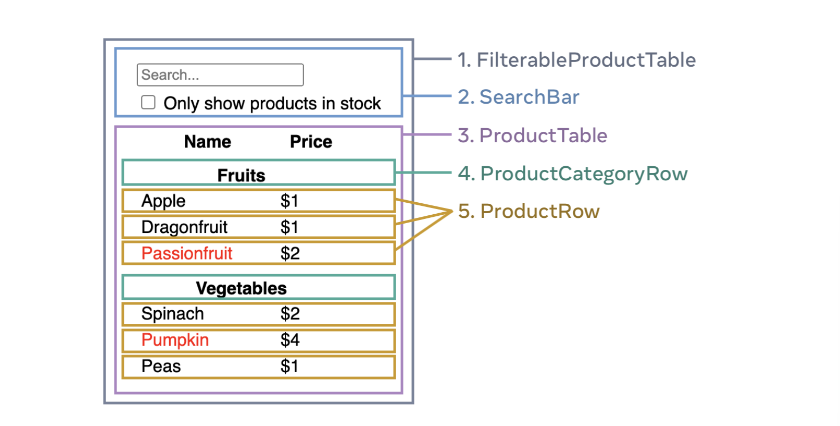

# React로 사고하기

## React로 UI를 구성하는 단계
React의 UI 구성 과정은 크게 5단계로 나눌 수 있다.

### 1. UI를 컴포넌트 계층으로 쪼개기

디자이너로부터 받은 모의 시안 화면을 여러 개의 **컴포넌트**로 쪼갠다. 각각의 컴포넌트와 그 컴포넌트의 하위 요소를 파악하여 **박스**를 그리고 이름을 붙여준다.

#### 컴포넌트 분리 기준

컴포넌트를 나누는 기준은 관점에 따라 다르다.

-   **Programming 관점**: 한 컴포넌트가 한 가지 역할만 하도록(단일 책임 원칙) 쪼갠다. 또한 컴포넌트가 너무 커지거나 복잡해지면 하위 컴포넌트로 분리한다.
-   **CSS 관점**: 시각적으로 스타일이 적용되는 단위를 기준으로 컴포넌트를 나눈다. (예: 버튼, 카드, 섹션 등)
-   **Design 관점**: 디자인 시스템이나 계층 구조에 따라 컴포넌트를 나눈다.

> 데이터가 잘 구조화된 JSON 형태로 주어진다면, 데이터 구조와 컴포넌트 구조가 비슷해지는 경우가 많다!

#### 예시

1. `FilterableProductTable`(회색): 전체를 감싸는 최상위 컴포넌트
2. `SearchBar`(파란색): 검색 입력을 담당
3. `ProductTable`(라벤더색): 상품 목록과 필터링 담당
4. `ProductCategoryRow`(초록색): 카테고리별 헤더
5. `ProductRow`(노란색): 개별 상품을 나타내는 행

> **[참고]** > `ProductATable`의 **Name/Price**헤더는 재사용되지 않고, 기능도 단순해서 별도 컴포넌트로 만들지 않음

정리된 컴포넌트들을 계층구조로 표현하면 다음과 같다.

-   `FilterableProductTable`
    -   `SearchBar`
    -   `ProductTable`
        -   `ProductCategoryRow`
        -   `ProductRow`

### 2. React로 정적인 버전 구현하기

컴포넌트를 나누고 나면 실제 동작(상호작용)없이 데이터를 받아 렌더링하는 정적인 화면을 만든다. 사용자의 입력이나 이벤트에 따라 화면이 바뀌지는 않는 버전이다.

이 단계에서는 `state`를 사용하지 않는다(state는 오직 상호작용, 즉 시간에 따라 변하는 데이터를 다룰 때 사용함)

#### 앱 구현 방식

앱을 만드는 방식에는 두 가지가 있다.

-   **하향식**: 최상위 컴포넌트부터 하위 컴포넌트로 내려가며 개발하는 방법으로 작은 예제나 단순한 앱에 적합하다.
-   **상향식**: 하위 컴포넌트부터 만들고, 이를 조합해 상위 컴포넌트를 완성하는 방법이다. 대규모 앱이나 테스트 중심 개발에 적합하다.

### 3. 최소한의 State 사용으로 상호작용 구현하기

정적 화면 구현이 끝나면, 사용자의 입력이나 이벤트에 따라 화면이 바뀌도록 **상호작용**을 추가해야 한다. 이 때 `state`를 사용한다.

> **[state란?]**
> 컴포넌트가 리렌더링되어도 유지되는 **React가 관리하는 변경 가능한 데이터**

#### state 사용 시 유의사항

이 때, `state`는 앱이 기억해야 하는 변경가능한 데이터의 **최소한의 집합**이다.
`state`를 구조화할 때에는 [중복배제원칙(Don’t Repeat Yourself)](https://ko.wikipedia.org/wiki/%EC%A4%91%EB%B3%B5%EB%B0%B0%EC%A0%9C)을 고려해야 한다.

애플리케이션이 필요로 하는 최소한의 `state`를 파악하고 나머지는 필요에 따라 실시간으로 계산하는 구조로 코드를 작성하는게 좋다.

#### state로 관리하는게 좋은 데이터

어떤 데이터를 `state`로 관리할지 말지 결정할 때는 다음 세 가지 질문을 해보면 된다.

1. **시간이 지나도 변하지 않는 값인가?**
   → 변하지 않는다면 `state`로 관리할 필요 없음
2. **부모 컴포넌트로부터 `props`로 전달받는 값인가?**
   → `props`로 받는 값이라면 `state`로 관리할 필요 없음
3. **컴포넌트 안의 다른 `state`나 `props`를 통해 계산할 수 있는가?**
   → 다른 `state`나 `props`로부터 계산될 수 있다면 `state`로 따로 저장할 필요 없음

이 세 가지에 모두 해당하지 않는 값만 `state`로 관리해주면 된다.

> **[예시]**
> 쇼핑리스트에서 상품 개수를 보여주고 싶다면, 별도의 `state`에 개수를 저장할 필요 없이 배열의 길이를 계산해서 보여주면 된다.

### 4. State의 위치 정하기

어떤 데이터를 `state`로 관리할지 결정했다면, 어느 컴포넌트가 이 `state`를 소유할지 정해야 한다.
즉, `state`를 어디에 선언할지 결정하는 단계이다.

이 때 React가 항상 컴포넌트 계층 구조를 따라 **부모에서 자식으로, 단방향으로 데이터를 전달**한다는 것을 염두에 둬야 한다.

#### state의 위치를 정하는 팁

1. 해당 `state`를 사용하는 모든 컴포넌트를 찾는다.
2. 컴포넌트들이 공통적으로 포함된 공통조상 컴포넌트를 찾는다.
3. 공통 조상 컴포넌트에 `state`를 선언한다.
    1. 대부분은 그냥 공통 부모에 `state`를 선언하면 된다.
    2. 경우에 따라 더 상위 컴포넌트에 `state`를 둘 수도 있다.
    3. 적절한 컴포넌트가 없다면 `state`를 소유하는 새로운 컴포넌트를 만들어 공통 조상으로 추가한다.
