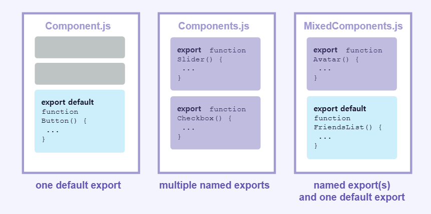

# 컴포넌트 import 및 export 하기

컴포넌트의 가장 큰 장점은 **재사용성**입니다. 컴포넌트를 조합하면 또 다른 컴포넌트를 만들 수 있습니다.

## Root 컴포넌트란?

리액트에서 기본 **root 컴포넌트 파일**은 `App.js`입니다. 이는 애플리케이션의 진입점(entry point)이 되는 최상위 컴포넌트로, 모든 컴포넌트를 감싸는 역할을 합니다. 설정을 통해 root 컴포넌트를 다른 파일에 위치시킬 수도 있습니다.

## 컴포넌트를 import하거나 export 하는 방법

컴포넌트가 여러 파일에서 사용되는 경우, 루트 파일 밑이 아닌 별도의 파일로 분리하는게 좋습니다. 파일을 분리함으로써 재사용성이 높아지고, 컴포넌트를 모듈로 사용할 수 있게 됩니다.

### 컴포넌트 분리 과정

1. 컴포넌트를 추가할 `JS` 파일을 **생성**합니다.
2. 새로 만든 파일에서 함수 컴포넌트를 **export** 합니다.
3. 컴포넌트를 사용할 파일에서 **import**합니다.

> **주의>** React에서는 `import`할 때 `'./Gallery.js'` 또는 `'./Gallery'` 모두 사용 가능하지만, 확장자를 명시하는 것이 native ES Modules 사용 방법에 더 가깝습니다.

### 컴포넌트 export 방법

컴포넌트는 **Default**와 **Named Exports** 두 가지 방법으로 내보낼 수 있습니다.

#### (1) default export

`default export`는 한 파일당 **하나만**존재할 수 있습니다.

| Syntax  | Export 구문                           | Import 구문                         |
| ------- | ------------------------------------- | ----------------------------------- |
| Default | `export default function Button() {}` | `import Button from './button.js';` |

`default export`로 내보낸 컴포넌트는 `import` 시 컴포넌트의 이름이 아닌 원하는 이름으로 가져올 수 있습니다.

#### (2) named export

`named export`는 여러 개가 존재할 수 있습니다.

| Syntax | Export 구문                   | Import 구문                             |
| ------ | ----------------------------- | --------------------------------------- |
| Named  | `export function Button() {}` | `import { Button } from './button.js';` |

`named import`를 사용할 때는 내보낸 이름과 가져오는 이름이 같아야 하며, 중괄호(`{}`)로 감싸야 합니다.

> 보편적으로 한 파일에서 하나의 컴포넌트만 `export` 할 때 `default export` 방식을 사용하고 여러 컴포넌트를 `export` 할 경우엔 `named export` 방식을 사용합니다.
