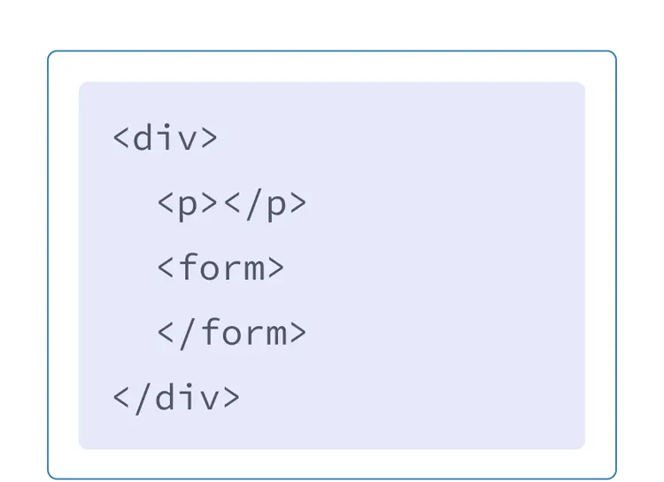
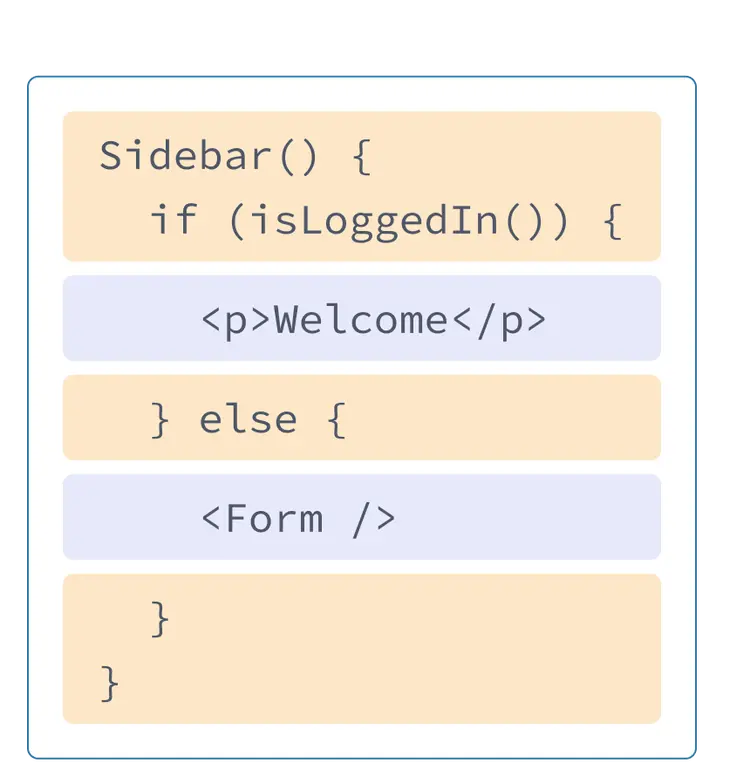

# JSX로 마크업 작성하기

**JSX**는 **JavaScript**를 확장한 문법으로, <ins>**JavaScript** 파일에서 **HTML**과 비슷하게 마크업을 작성</ins>할 수 있도록 해줍니다. 이를 통해 렌더링 로직과 UI(마크업)를 한 곳에 모아 관리할 수 있습니다.

## JavaScript에 마크업 넣기

전통적으로 웹 개발에서는 **HTML**, **CSS**, **JavaScript**를 각각 분리된 파일로 관리했습니다.

하지만 웹의 **상호작용**이 많아지면서, 로직에 따라 내용이 동적으로 결정되는 경우가 많아졌습니다. 이에 따라 React에서는 **렌더링 로직과 마크업이 같은 위치(컴포넌트 내부)에 함께 있게 되었습니다.**

버튼의 렌더링 로직과 버튼의 마크업을 한 파일에 두면, 변화가 생길 때 동기화 상태를 쉽게 유지할 수 있습니다.

반대로 버튼의 마크업과 사이드바의 마크업처럼 서로 관련이 없는 항목들은 각각 별도의 컴포넌트로 분리하여 관리하는 것이 더 안전합니다.

React의 각 컴포넌트는 브라우저에 마크업을 렌더링할 수 있게 하는 JavaScript 함수입니다. JSX는 HTML과 비슷하지만, 더 엄격하며 동적으로 정보를 표시할 수 있게 해줍니다.

## JSX의 규칙

### 1. 하나의 루트 엘리먼트로 반환하기

한 컴포넌트에서 여러 엘리먼트를 반환하는 경우 **하나의 부모 태그로 감싸야 합니다.**
`
`태그 또는 **Fragment**(`<></>`)로 감싸줍니다. **Fragment**로 감싸는 경우, HTML 트리 구조에 불필요한 래퍼 태그가 남지 않습니다.

> JSX는 내부적으로 일반 **JavaScript**객체로 변환되기 때문에, 하나의 함수에서 여러 개의 객체를 반환할 수 없습니다.

### 2. 모든 태그는 닫아주기

JSX에서는 **모든 태그를 명시적으로 닫아야 합니다.**

-   `` 또는 `
...
`

### 3. 대부분 캐멀 케이스 사용

<ins>JSX에서 작성된 어트리뷰트는 JavaScript 객체의 키가 됩니다.</ins> JavaScript에서는 객체의 키 또는 변수명에 `-`를 포함하거나 `class`와 같은 예약어를 사용할 수 없으므로, React에서는 HTML과 SVG의 어트리뷰트 대부분이 캐멀 케이스로 작성됩니다.

-   `class`는 자바스크립트의 예약어이기 때문에 `className`을 사용합니다.
-   `for` 대신 `htmlFor`를 사용합니다.

> **주의 >** 역사적인 이유로, `aria-*`와 `data-*`의 어트리뷰트는 HTML에서와 동일하게 대시를 사용하여 작성합니다.

> **팁 >** [변환기](https://transform.tools/html-to-jsx)를 사용하여 HTML과 SVG를 JSX로 변환할 수 있습니다.
