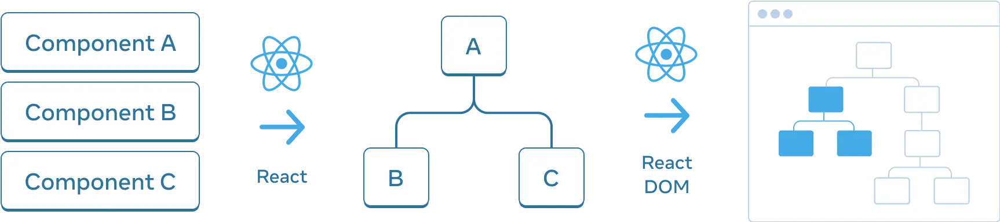
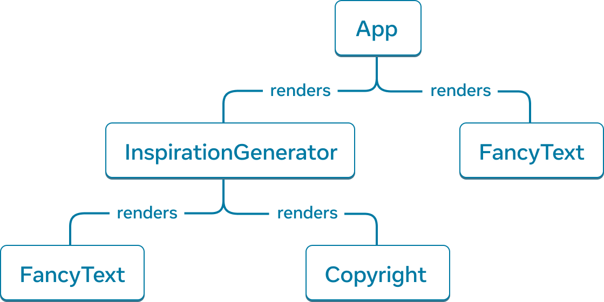
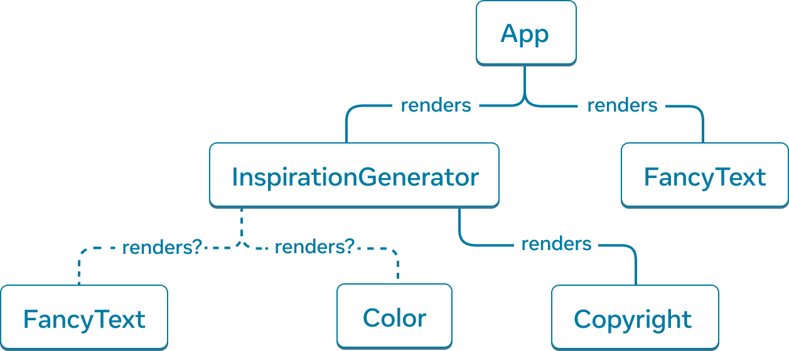
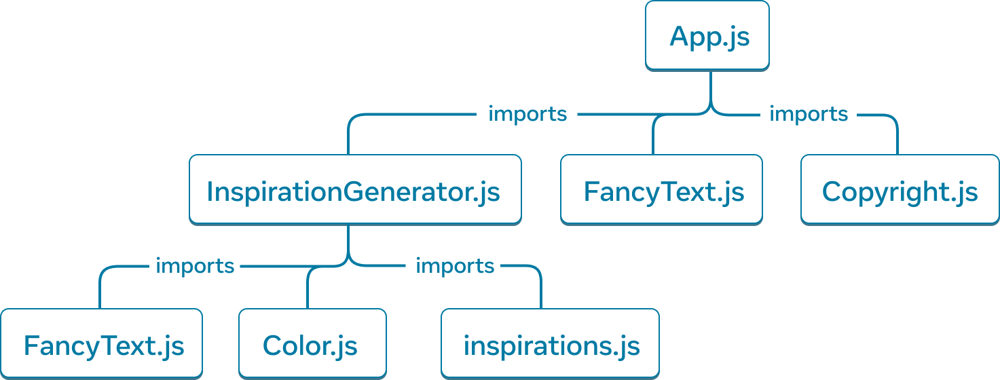

# 트리로서 UI 이해하기

React 앱에서 UI를 트리 구조로 바라보면 데이터 흐름, 렌더링, 최적화를 이해하기 쉽습니다.

## 트리로서의 UI

트리는 요소 간 관계를 모델링할 때 자주 쓰이는 구조입니다. 브라우저는 HTML과 CSS를 각각 DOM 트리, CSSOM 트리로 모델링하며, React 또한 컴포넌트를 트리 구조로 관리합니다.



> 트리는 React 앱에서 데이터가 흐르는 방식과 렌더링 및 앱 크기를 최적화하는 방법을 이해하는 데 유용한 도구입니다.

## 렌더 트리

React 앱을 렌더링 할 때 각 컴포넌트의 부모-자식 관계를 **렌더 트리**로 모델링할 수 있습니다. 각 노드는 컴포넌트를 나타내며, 루트 노드는 앱의 Root 컴포넌트입니다.

```js
import FancyText from './FancyText';
import InspirationGenerator from './InspirationGenerator';
import Copyright from './Copyright';

export default function App() {
    return (
        <>
            <FancyText title text="Get Inspired App" />
            <InspirationGenerator>
                <Copyright year={2004} />
            </InspirationGenerator>
        </>
    );
}
```

위 코드의 렌더트리는 다음과 같습니다.



### 조건부 렌더링과 렌더 트리

조건부 렌더링을 사용하면, 부모 컴포넌트가 전달한 데이터에 따라 다른 자식 컴포넌트가 렌더링될 수 있습니다. 이 경우 렌더 트리는 각 렌더링마다 달라질 수 있습니다.



### 렌더 트리에서 노드 이해

-   **최상위 컴포넌트:** 렌더 트리의 루트에 가까운 컴포넌트로, 하위 모든 컴포넌트의 렌더링 성능에 영향을 미치며 복잡성이 높습니다.
-   **리프 컴포넌트:** 트리의 맨 아래에 있으며 자식 컴포넌트가 없습니다. 리렌더링 빈도수가 높습니다.

## 모듈 의존성 트리

React 앱의 모듈 의존성 또한 트리로 모델링할 수 있습니다. 각 노드는 모듈(파일)을 나타내며, 각 가지는 `import` 문을 의미합니다.



### 모듈 의존성 트리의 이해

-   **루트 노드:** 루트 모듈(엔트리 포인트 파일, 보통 루트 컴포넌트를 포함하는 파일)
-   **모듈 트리:** 컴포넌트뿐 아니라 유틸리티, 라이브러리 등 모든 모듈이 포함될 수 있습니다.

> 번들러(Webpack, Vite 등)는 의존성 트리를 분석해 클라이언트에 제공할 모든 JavaScript를 하나의 번들로 묶습니다.
