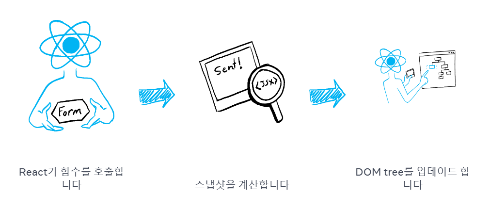
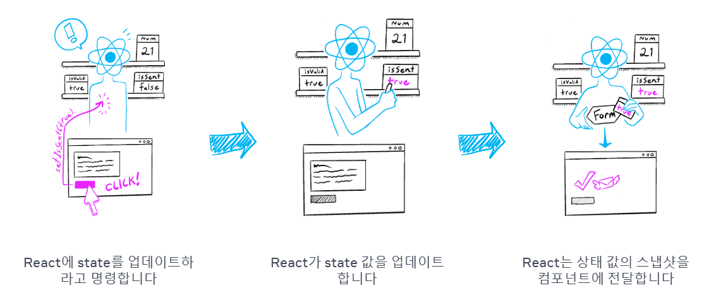

# 스냅샷으로서의 State

**state**는 일반 자바스크립트 변수처럼 보이지만, 실제로는 **렌더링 시점에 고정된 값(스냅샷)**으로 동작합니다.

state는 컴포넌트가 렌더링될 때의 값이 그대로 고정되기 때문에, 이벤트 핸들러 함수나 비동기 코드 내에서도 변경되지 않습니다.

## State와 렌더링의 관계

state를 업데이트하기 위해 `setter 함수 호출`하면 React는 리렌더링을 위해 내부 큐에 등록합니다. 그리고 React 내부의 렌더링 스케줄러 시스템이 이를 처리하여 컴포넌트 함수를 다시 호출합니다.

이 과정에서 새로운 `state`값이 반영된 UI가 그려지게 됩니다.

> **렌더링이란?**
>
> React가 컴포넌트 함수를 다시 호출하여, 해당 시점의 state, prop, 이벤트 핸들러, 로컬 변수 등을 바탕으로 JSX(UI 스냅샷)를 반환하는 과정입니다.
> React는 이 JSX 스냅샷을 비교하여 실제 화면을 효율적으로 업데이트합니다.



-   **state는 컴포넌트의 메모리 역할**을 하며, 렌더링이 끝나면 사라지는 일반 변수와 달리 **React가 관리**합니다.
-   React는 컴포넌트 함수를 호출할 때마다, 해당 렌더링 시점의 state 값(스냅샷)을 제공합니다.
-   컴포넌트는 이 state 값을 사용해 props, 이벤트 핸들러, 로컬 변수 등을 계산하고, 최종적으로 JSX를 반환합니다.
-   React는 반환된 JSX 스냅샷과 일치하도록 화면을 업데이트합니다.



## 업데이트의 이해

아래 코드에서 `'+3'` 버튼을 클릭하면 `setNumber(number + 1)`를 세 번 호출합니다. 하지만 `number`의 값은 `number + 3`이 아닌 `number + 1`로 업데이트 됩니다.

```jsx
export default function Counter() {
    const [number, setNumber] = useState(0);

    return (
        <>
            <h1>{number}</h1>
            <button
                onClick={() => {
                    setNumber((number) => number + 1);
                    setNumber((number) => number + 1);
                    setNumber((number) => number + 1);
                }}
            >
                +3
            </button>
        </>
    );
}
```

**왜 이런 현상이 발생할까?**

-   state 값은 렌더링 시점에 고정되어 있습니다.
-   이벤트 핸들러 내부에서 number를 여러 번 바꿔도, 실제로는 모두 같은 값(렌더링 시점의 값)을 사용합니다.
-   따라서, React는 다음 렌더링에서 number를 1로 업데이트할 준비만 세 번 하게 됩니다.
-   결과적으로, number는 0에서 1로만 한 번 증가합니다.

버튼의 클릭 핸들러는 React에 다음 작업을 지시합니다.

> state 변수의 값은 이벤트 핸들러의 코드가 비동기적이어도, 렌더링 내에서 절대 변경되지 않습니다.
> 여러 state 업데이트가 예약되더라도, 렌더링이 끝난 뒤에야 새로운 state 값이 반영됩니다.
