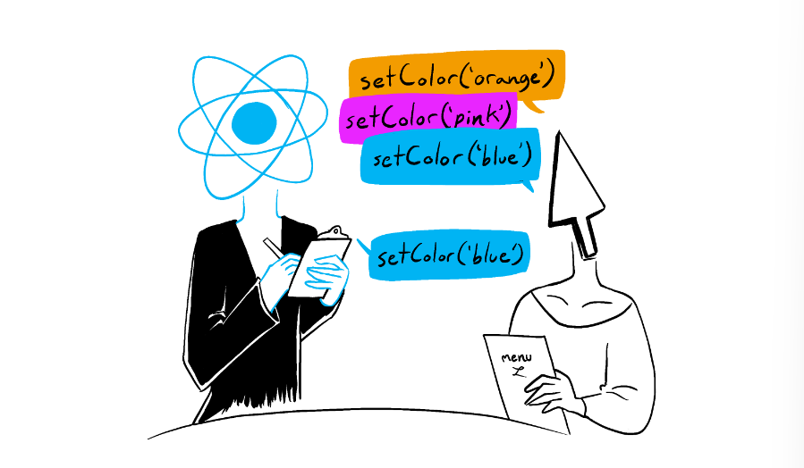

# state 업데이트 큐

state 변수를 설정하면 React는 **해당 state의 변경을 큐에 추가**하고, **다음 렌더링에서 반영**합니다.

## React의 state 업데이트 배칭

**React는 state 업데이트를 하기 전에 이벤트 핸들러의 모든 코드가 실행될 때까지 기다립니다.** 이벤트 핸들러가 종료하면 큐에 쌓인 state를 한 번에 업데이트합니다.

```js
export default function Counter() {
    const [number, setNumber] = useState(0);

    return (
        <>
            <h1>{number}</h1>
            <button
                onClick={() => {
                    setNumber(number + 1);
                    setNumber(number + 1);
                    setNumber(number + 1);
                }}
            >
                +3
            </button>
        </>
    );
}
```

### batching의 정의

배칭이란, **여러 state 업데이트를 하나의 큐에 모아서 처리**하는 것을 의미합니다. 이벤트 핸들러 내에서 여러 state를 변경해도, **리렌더링은 한 번만 발생**하므로 잦은 리렌더링을 방지할 수 있으며, 성능을 향상시킬 수 있습니다. 또한 일부 변수만 업데이트된 혼란스러운 렌더링을 방지할 수 있습니다. React는 클릭과 같은 의도적 이벤트에 대해서는 **batch**를 수행하지 않습니다. batch를 수행해도 되는 안전한 경우에만 사용합니다.

> **비유로 이해하기**
>
> 음식점에서 웨이터가 손님의 모든 주문을 다 받은 뒤에 주방에 전달하는 것과 비슷합니다.
> 웨이터가 주문을 하나씩 전달하지 않고, 모든 주문을 한 번에 모아 전달하므로 효율적입니다.
> 

## 리렌더링 전에 동일한 state 변수를 여러 번 업데이트하기

`setNumber(number + 1)`처럼 값을 직접 전달하면, 각 업데이트가 동일한 **현재 state 값을 기반으로 동작**합니다. 이 경우, 같은 스냅샷을 사용하기 때문에 여러 번 호출해도 최종적으로는 한 번만 값이 증가합니다. 만약 이전 업데이트 결과를 기반으로 다음 업데이트를 하고 싶다면, 업데이터 함수를 사용해야 합니다.

### 업데이터 함수

`setter`함수에 인자로 전달되는 함수를 **업데이터 함수**라고 합니다.

업데이터 함수는 `setNumber(n => n + 1)`처럼, 이전 `state` 값을 인자로 받아 새로운 값을 반환하는 함수입니다.

React는 이벤트 핸들러의 모든 코드가 실행된 후, **큐에 쌓인 업데이터 함수를 순차적으로 처리**합니다.

다음 렌더링 중에 `useState`가 호출될 때, React는 큐에 쌓인 업데이터 함수를 순서대로 실행하여 **최종 state를 계산**합니다.

#### 실행 방식

다음과 같은 코드가 있다고 할 때, 업데이터 함수 실행 방식은 다음과 같습니다.

```js
setNumber((n) => n + 1);
setNumber((n) => n + 1);
setNumber((n) => n + 1);
```

1. React는 이벤트 핸들러가 실행되는 동안 호출된 업데이터 함수를 내부 큐에
    - `setNumber(n => n + 1)`: `n => n + 1` 함수를 큐에 추가
    - `setNumber(n => n + 1)`: `n => n + 1` 함수를 큐에 추가
    - `setNumber(n => n + 1)`: `n => n + 1` 함수를 큐에 추가
2. 다음 렌더링 중에 React는 큐를 순회하며 최종 업데이트된 state를 계산하여 제공합니다.
    - 첫 번째 업데이터 함수: `n = 0` → 반환값: `1`
    - 두 번째 업데이터 함수: `n = 1` → 반환값: `2`
    - 세 번째 업데이터 함수: `n = 2` → 반환값: `3`

-   최종적으로 `number`의 값은 3이 됩니다.
-   > React는 이전 업데이터 함수의 **반환 값**을 다음 업데이터 함수에 **인자**로 전달하는 식으로 반복하여 state를 계산합니다.

#### 업데이터 함수의 명명 규칙

업데이터 함수의 인수는 보통 **해당 state 변수의 첫 글자 또는 전체 이름**을 사용합니다.

```js
setEnabled((e) => !e);
setLastName((ln) => ln.reverse());
setFriendCount((fc) => fc * 2);
```

좀 더 자세한 코드를 선호하는 경우 `setEnabled(enabled => !enabled)`와 같이 전체 state 변수 이름을 반복하거나, `setEnabled(prevEnabled => !prevEnabled)`와 같은 접두사를 사용하는 것이 널리 사용되는 규칙입니다.
