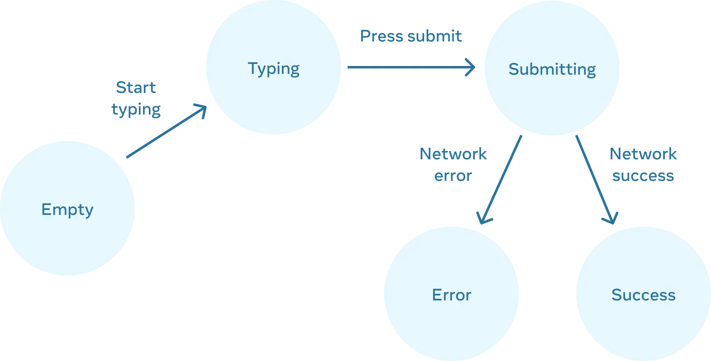

# State를 사용해 Input 다루기

**React는** 선언형 방식으로 UI를 조작한다. 상태에 따라 어떤 걸 보여줄지 선언하면, 보여주는 건 React가 알아서 처리한다.

## 선언적 UI란?

-   명령형 UI: UI의 각 요소(버튼, 입력창 등)를 직접 조작(활성화/비활성화, 표시/숨김 등)해야 한다.
-   선언적 UI: UI의 상태만 기술하면, React가 알아서 DOM을 업데이트한다.

> 어떤 상태에서 무엇을 보여줄지 선언만 하면, React가 알아서 UI를 업데이트!

## 폼 예시로 UI 상태 흐름 확인하기

### 1. 폼의 상태 종류

폼은 입력 및 제출 과정에서 여러 시각적 상태를 가진다. 각 상태에 따라 UI가 다르게 보여야 한다.

| 상태         | 설명                                            |
| ------------ | ----------------------------------------------- |
| `Empty`      | 입력값이 없을 때, 제출 버튼 비활성화            |
| `Typing`     | 입력 중, 제출 버튼 활성화                       |
| `Submitting` | 제출 중, 폼 전체 비활성화 + 스피너 표시         |
| `Success`    | 제출 성공, 폼 대신 “감사합니다” 메시지 표시     |
| `Error`      | 제출 실패, 오류 메시지 표시(폼은 다시 활성화됨) |

### 2. UI 상태 변화 요인

UI의 상태를 변화시키는 요인은 크게 두 가지이다.

> 1. 사용자의 입력 (버튼 클릭, 필드 입력, 링크 이동)
> 2. 컴퓨터의 입력 (네트워크 응답, 타임아웃, 로딩 완료)

이러한 입력에 따라 `state` 변수를 설정하고, 해당 `state`에 따라 UI가 자동으로 갱신된다.

### 3. 상태 흐름도

1. 입력값 변경

    - 사용자가 입력하면 `answer` state가 바뀜
    - 입력값이 비어있으면 `Empty`, 입력 중이면 `Typing`

2. 제출 버튼 클릭

    - `status`를 `'submitting'`으로 변경

3. 네트워크 응답 성공

    - `status`를 `'success'`로 변경

4. 네트워크 응답 실패

    - `status`를 `'typing'`으로 변경하고, `error`에 메시지 저장



### 4. 코드 구현

모든 상태를 별도의 `state`변수를 선언해서 관리할 수도 있다.

```jsx
const [isEmpty, setIsEmpty] = useState(true);
const [isTyping, setIsTyping] = useState(false);
const [isSubmitting, setIsSubmitting] = useState(false);
const [isSuccess, setIsSuccess] = useState(false);
const [isError, setIsError] = useState(false);
```

하지만 이렇게 하면 **불필요한 중복**과 **불가능한 상태**가 생길 수도 있다.

리팩토링하면 다음과 같다.

```jsx
const [answer, setAnswer] = useState('');
const [error, setError] = useState(null);
const [status, setStatus] = useState('typing'); // 'typing', 'submitting', 'success'
```

-   `isEmpty`는 `answer.length === 0`으로 계산 가능
-   `isError`는 `error !== null`로 확인 가능
-   하나의 상태 변수로 불가능한 상태 조합을 방지

## 상태 설계 원칙 정리

-   모든 시각적 상태를 먼저 정의한 후, 핵심 state만 남긴다.

-   불가능한 상태 조합이 생기지 않도록 state를 설계한다.

-   계산 가능한 상태는 변수 대신 조건식으로 처리한다.

-   UI는 **오직 상태(state)**에 따라 렌더링되고, 상태는 이벤트 핸들러로만 변경된다.
