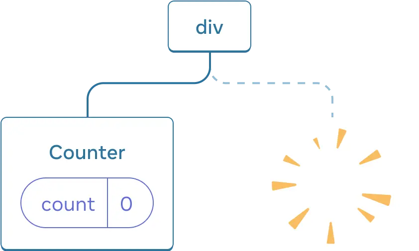
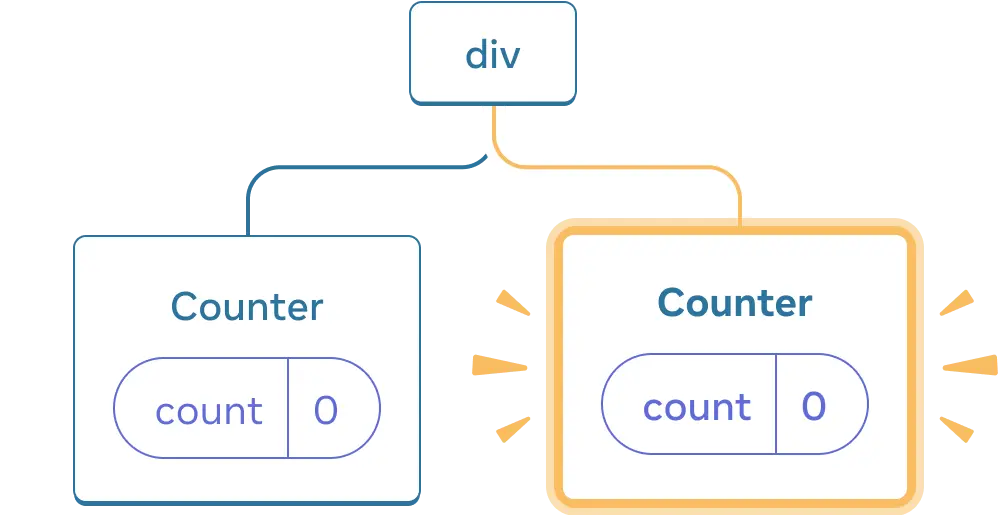
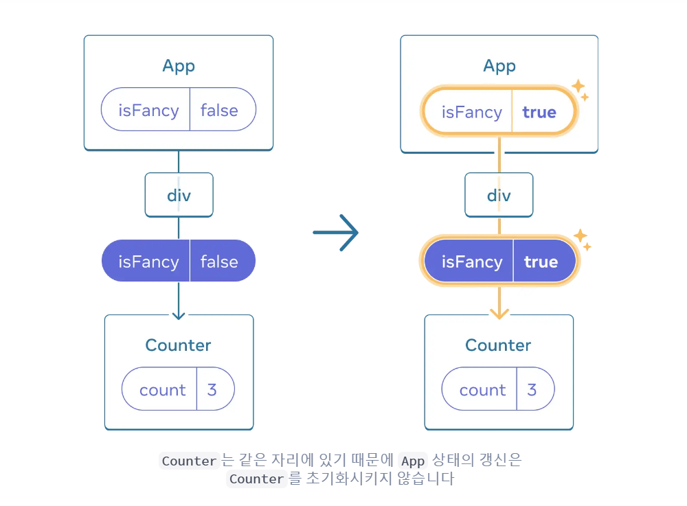
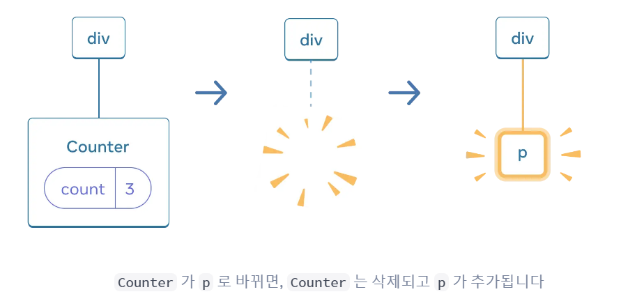
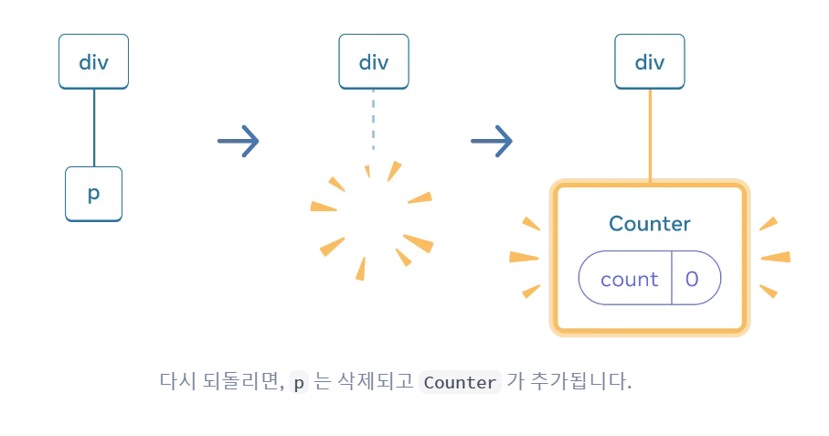
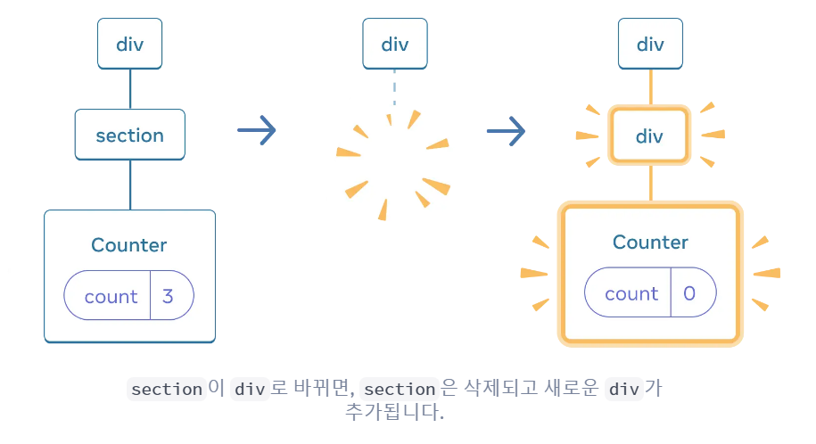
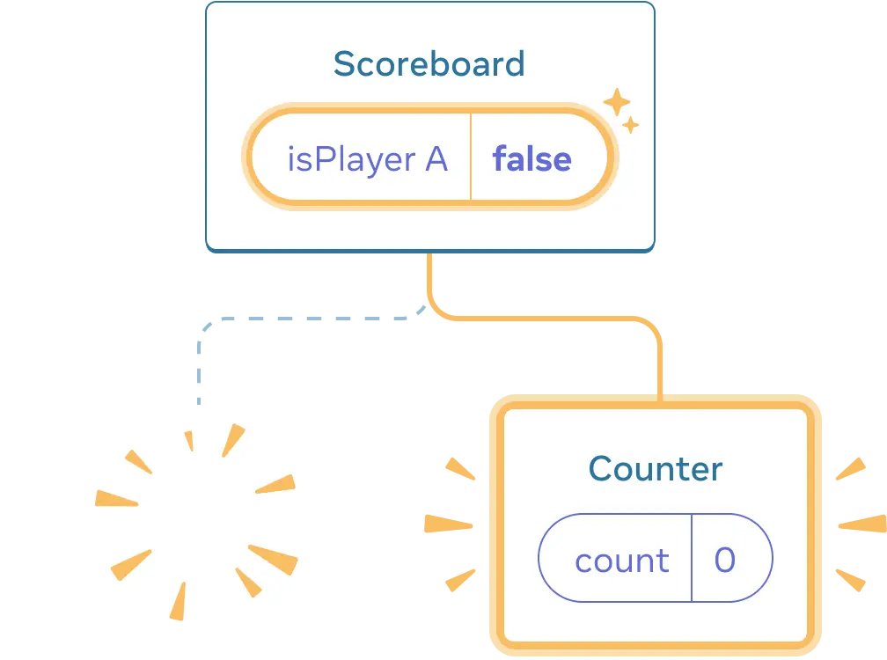

# State를 보존하고 초기화하기

React에서 state는 컴포넌트의 위치와 밀접한 관련이 있다. 동일한 위치에 동일한 컴포넌트가 렌더링되는 동안 state가 유지되며, 위치나 타입이 바뀌면 state가 초기화 된다.

## State와 렌더 트리의 관계

-   각 컴포넌트는 독립적인 state를 가진다.
-   실제로 state는 컴포넌트 내부가 아니라, React가 관리하는 UI 트리의 위치에 연결되어 있다.
-   같은 위치에 같은 컴포넌트가 렌더링되면 state가 유지되고, 다른 컴포넌트가 오면 state가 초기화된다.

> 리액트는 컴포넌트를 제거할 때, `state`도 같이 제거한다.

-   **삭제**
    

-   **재생성**
    

## 같은 위치, 같은 컴포넌트 → state 보존

```jsx
function App() {
    const [isFancy, setIsFancy] = useState(false);
    return <div>{isFancy ? <Counter isFancy={true} /> : <Counter isFancy={false} />}</div>;
}
```

-   `isFancy` 값이 바뀌어도 `<Counter />`는 동일한 위치(App 컴포넌트의 첫 번째 자식)에 있기 때문에 state가 유지된다.



> **주의**⚠️
> React는 JSX의 조건문 위치가 아니라, **최종적으로 반환되는 UI 트리의 구조**만을 기준으로 동일 위치 여부를 판단한다.

## 같은 위치, 같은 컴포넌트 → state 초기화

같은 자리에 다른 컴포넌트를 렌더링하면 state가 초기화된다.

```jsx
function App() {
    const [isPaused, setIsPaused] = useState(false);
    return <div>{isPaused ? <p>See you later!</p> : <Counter />}</div>;
}
```

-   `isPaused`가 `true`가 되면 `<Counter/>`가 `<p>`로 교체되고, 다시 `false`가 되면 `<Counter />`가 초기화되어 `state`가 0부터 시작한다.




> 같은 위치에 다른 컴포넌트를 렌더링하면 컴포넌트는 기존 컴포넌트의 서브트리의 state를 초기화한다.

부모 태그가 바뀌는 경우도 마찬가지이다.

```jsx
function App(){
    return (
        {isFancy ? (
            <div>
            <Counter isFancy={true} />
            </div>
        ) : (
            <section>
            <Counter isFancy={false} />
            </section>
        )}
    )
}
```



-   `section`이 DOM에서 제거될 때 자식 태그인 `Counter`와 State 모두 제거된다.

> 리렌더링할 때 State를 유지하고 싶은 경우 **트리구조가 같아야 한다.**

## 같은 위치에서 state를 초기화하는 방법

같은 위치에서 `State`를 초기화하고 싶은 경우 다음 두 가지 방법을 사용할 수 있다.

### 1: 다른 위치에 컴포넌트 렌더링하기

두 `Counter`가 독립적이기를 원하는 경우 다른 위치에서 렌더링할 수 있다.

```jsx
function App() {
    const [isPlayerA, setIsPlayerA] = useState(true);

    return (
        <div>
            {isPlayerA && <Counter person="Taylor" />}
            {!isPlayerA && <Counter person="Sarah" />}
        </div>
    );
}
```

-   초기에는 `isPlayerA`가 `true`이므로 첫 번째 자리에 `<Counter/>`가 있고 두 번째 자리는 비어있다.
-   "Next player"를 누르면 첫 번째 자리는 비워지고 두 번째 자리에 `<Counter/>`가 온다.



-   이 때 버튼을 누를 때마다 각 `<Counter/>` 제거된다. 따라서 state도 초기화된다.

> 같은 자리에 적은 수의 독립된 컴포넌트를 갖고 있는 경우 사용하기 편리한 방법이다.

### 2: Key 속성 활용하기

State를 초기화하는 일반적인 방법이다.

`key`는 배열을 렌더링할 때에만 쓰이는 속성이 아니고 React가 컴포넌트를 구별할 수 있도록 도와주는 속성이다.

기본적으로 React는 컴포넌트를 구별하기 위해 **부모안에서의 순서**를 이용하지만, `key`를 사용하면 특정한 컴포넌트를 지정할 수 있다.

> key를 다르게 주면, 같은 위치여도 React가 다른 컴포넌트로 인식해 state를 초기화한다.

```jsx
{
    isPlayerA ? <Counter key="Taylor" person="Taylor" /> : <Counter key="Sarah" person="Sarah" />;
}
```

#### key를 활용한 폼 초기화 예제

```jsx
export default function Messenger() {
    const [to, setTo] = useState(contacts[0]);
    return (
        <div>
            <ContactList contacts={contacts} selectedContact={to} onSelect={(contact) => setTo(contact)} />
            <Chat contact={to} key={to.id} />
        </div>
    );
}
```

-   수신자를 바꿀 때마다 `<Chat>` 컴포넌트의 state(입력값 등)가 초기화된다.

#### 추가적인 특성

-   key는 **부모 안에서만 고유**하면 된다.
-   key에는 문자열 또는 숫자만을 저장할 수 있다. (반드시 원시값이어야 하며, 객체를 넣는 경우 내부적으로 문자열로 변환하면서 `"[object Object]"`가 키가 된다.)
